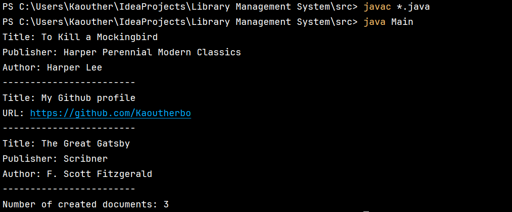

# Library Management System 📚

Welcome to the Library Management System! This Java-based project facilitates efficient management of a library, allowing users to add books and internet resources, visualize the library's contents, and practice object-oriented programming principles.

## Table of Contents

- [Description](#description) 📝
- [Features](#features) ✨
- [Exercises](#exercises) 🏋️‍♂️
- [Classes](#classes) 📚
- [Usage](#usage) 🚀
- [Tools and Languages](#tools-and-languages) 🔧
- [Execution](#execution) 💻

## Description 📝

The Library Management System streamlines the creation and manipulation of documents within a graphical space. It includes classes for books, internet resources, and a library, ensuring seamless document creation, modification, and visualization.

## Features ✨

- **Create Documents**: Generate drawings with multiple rectangles to visualize complex layouts.
- **Add Books and Internet Resources**: Dynamically add books and internet resources to your library.
- **Count Created Documents**: Get insights into the number of documents created in the application.

## Exercises 🏋️‍♂️

- **Exercise 2**: Implementing encapsulation in the Point class.
- **Exercise 3**: Implementing constructors, Rectangle class, and methods for calculating length, width, and area.
- **Exercise 4**: Consider the Dessin class; a drawing consists of multiple rectangles.
- **Exercise 5**: Test Java method parameter passing by value and reference.

## Classes 📚

- **Document.java**: Represents a document with attributes and methods for document management.
- **Book.java**: Represents a book, extending the Document class, with additional attributes and methods.
- **Internet.java**: Represents an internet resource, extending the Document class, with additional attributes and methods.
- **Library.java**: Represents a library containing an array of documents, with methods for document management.

## Usage 🚀

1. **Clone the Repository**: Clone this repository to your local machine using `git clone https://github.com/Kaoutherbo/Library-Management-System.git`.
2. **Navigate to the Project Directory**: Open a terminal and move into the project directory.
3. **Navigate to the Source Directory**: Change directory to the `src` folder.
4. **Compile and Run**: Compile and run the `Main.java` file.
    - Compile: `javac *.java`
    - Run: `java Main`
5. **Interact with the Application**: Follow the on-screen instructions to manage the library, add documents, and calculate the total area.

## Tools and Languages 🔧

- **Java**: Primary programming language.
- **IntelliJ IDEA**: Integrated Development Environment (IDE).

## Execution 💻
